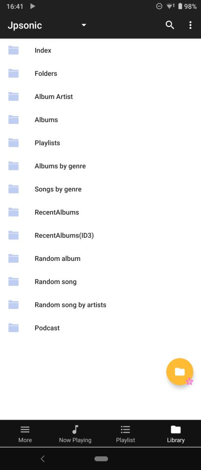
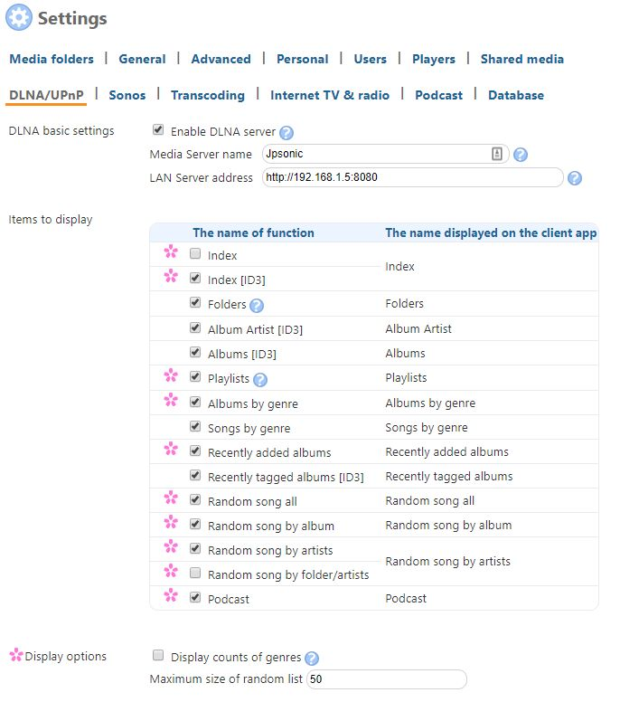

<!--
# README.md
# jpsonic/jpsonic
-->

 
 

Jpsonic
========

What is Jpsonic?
-----------------

<table>
<tr>
<td>
Jpsonic is a free, web-based media streamer, providing ubiquitous access to your music.

Use it to share your music with friends, or to listen to your own music while at work.
Based on Java technology, Jpsonic runs on most platforms, including Windows, Mac, Linux and Unix variants.

Jpsonic is an [Airsonic](https://github.com/airsonic/airsonic) Clone.
</td>
<td>

</td>
</tr>
</table>

What is the difference from Airsonic?
-----------------

Optimized for Japanese needs.
The language processing suitable for Japanese and the DLNA function frequently used by Japanese are enhanced.

Even if the server is linked to a famous external service, Japanese song information may not be easily linked.
For this reason, Jpsonic is focusing on enhancing tag processing via CDDB.
Sony/Apple tag specifications, which have a significant impact on commercial areas in Japan, are taken into account.

Tags supported by Jpsonic

Supports multiple genres.

|tag name |tag id|Subsonic/Airsonic |Jpsonic |Music Center (SONY) |itunes (APPLE)
|:---|:---|:---:|:---:|:---:|:---:|
|title |TIT2 |● |● |● |●
|title sort|TSOT | |● |● |●
|artist|TPE1 |● |● |● |●
|artist sort|TSOP | |● |● |●
|album |TALB |● |● |● |●
|album sort|TSOA | |● |● |●
|album artist|TPE2 |● |● |● |●
|album artist sort|TSO2 | |● |● |●
|genre|TCON |● |● |● |●
|Release year|TYER |● |● |● |●
|composer|TCOM | |● |● |●
|composer sort|TSOC | |● | |●
|track no|TRCK |● |● |● |●
|disk no|TPOS |● |● |● |●

The reason Jpsonic refers to the SONY/APPLE specification is that their specifications take into account global multilingual support.

Features
-----------------

### Enhanced meta processing

To process Japanese well on a machine requires a lengthy mechanism. Conversely, if the system can handle Japanese well, it may be easy a little easier to support languages in other countries. Jpsonic will work without conflict, except in special cases like other chinese-character (except JP) and Arabic.

Enhanced index function

<table>
<tr>
<td>
 
Many character types such as alphabet/hiragana/katakana/chinese character/symbols are used in Japanese.

Jpsonic correctly classifies them and creates a Japanese index.
It is a very general and easy-to-understand index for Japanese people, just like Japanese dictionaries, bank branch names, telephone directories and karaoke indexes.
</td>
<td>

</td>
</tr>
</table>

Also, Japanese generally read ligatures in English.
Therefore, decomposable ligatures are categorized alphabetically by default.
Even if used by non-Japanese, the index will be slightly different from Airsonic.

Enhanced sort function

<table>
<tr>
<td>

 - Sort by name is expanded to allow for Japanese character string sorting. Even with a variety of character types, Japanese people can use it without feeling uncomfortable.
 - Advanced sorting is available with options. (``Albums of artists starting with "various" are not sorted by year`` / ``sorted considering serial numbers``)

</td>
<td>

</td>
</tr>
</table>

Jpsonic does special processing for sort tags.

 - Strings are washed (full-width, half-width, etc.).
 - If multiple Sort tags are registered for one name in the library, they will be merged
 - If the tag is not registered and the name is Japanese, it will be supplemented by Japanese analysis

CDDB sort tags are not perfect.
These are necessary to achieve perfect sorting, reduce the size of the index and prevent missing searches.

These are done automatically after the scan.

Enhanced search function

<table>
<tr>
<td>
Supports phrase search.
In addition, the sort tags corresponding to each field will also be searched.

When searching, Japanese people enter the reading.
Finally, convert to an appropriate character type with IME conversion.
People in the countries that use Ideograph unknowingly perform complicated input procedures.
Jpsonic allows you to search while inputting IME conversion.

In addition to the phrase search, the old Subsonic search, the multi term search, is also maintained. It can be switched by the option.
</td>
<td>

</td>
</tr>
</table>

The search engine analyzer has been changed to a Japanese analyzer.
This does not mean that only Japanese people can use it.
Of course, Japanese people also listen to songs other than Japanese.

### Extension of DLNA function

<table>
<tr>
<td>

</td>
<td>

DLNA (UPnP) is hardly improved in Subsonic/Airsonic.

But DLNA (UPnP) is still popular in Japan, and OpenHome is also Hot.
For this reason, Jpsonic has many new features.

You can add or delete items you want to use from the setting screen.
These features include those that are not supported on the web.
Id3 index etc.

Unlike Subsonic/Airsonic, Jpsonic has integrated and refactored sort-logic.
Therefore, tree expansion on UPnP works faster than Subsonic/Airsonic.
Of course, all sort-logic of Web/REST/UPnP work with the same rules.

</td>
</tr>
</table>

<table>
<tr>
<td>

For Jpsonic DLNA, you can specify the Music Folder to be published.
You can also use apps that support voice search, such as [BubbleUPnP](https://play.google.com/store/apps/details?id=com.bubblesoft.android.bubbleupnp&hl=en).

</td>
<td>

</td>
</tr>
</table>

History
-----

Subsonic, Libresonic, Airsonic

The original *[Subsonic](http://www.subsonic.org/)* is developed by [Sindre Mehus](mailto:sindre@activeobjects.no). *Subsonic* was open source through version 6.0-beta1, and closed-source from then onwards.

*Libresonic* was created and maintained by [Eugene E. Kashpureff Jr](mailto:eugene@kashpureff.org). It originated as an unofficial("Kang") of Subsonic which did not contain the Licensing code checks present in the official builds. With the announcement of Subsonic's closed-source future, a decision was made to make a full fork and rebrand to Libresonic.

Around July 2017, it was discovered that Eugene had different intentions/goals for the project than some contributors had. 
*Airsonic* was created in order to provide a full-featured, stable, self-hosted media server based on the Subsonic codebase that is free, open source, and community driven.

Jpsonic

Around July 2018, *Jpsonic* was created in order to strengthen browsing and searching in Japanese.

In Japan, Subsonic is famous, but Airsonic was not yet well known.
Today, Airsonic, with its great engineers and great community, is gaining recognition.

Jpsonic had to update its indexing, sorting, and searching due to its characteristics.
Many of these features have bug fixes or enhancements.
An update to the Jpsonic search engine has been provided to Airsonic.
Therefore, the design of the search function of Airsonic and Jpsonic is a bit similar.

Cherry Blossoms
-----

The Japanese loved cherry blossoms for hundreds of years.

Please ask the Japanese people "What is a flower?".

The Japanese will answer "Sakura".

During international exchange, Japan frequently plants cherry blossoms to show respect for partners.

License
-------

Jpsonic is free software and licensed under the [GNU General Public License version 3](http://www.gnu.org/copyleft/gpl.html). The code in this repository (and associated binaries) are free of any "license key" or other restrictions.

The [Subsonic source code](https://github.com/airsonic/subsonic-svn) was released under the GPLv3 through version 6.0-beta1. Beginning with 6.0-beta2, source is no longer provided. Binaries of Subsonic are only available under a commercial license. There is a [Subsonic Premium](http://www.subsonic.org/pages/premium.jsp) service which adds functionality not available in Airsonic. Subsonic also offers RPM, Deb, Exe, and other pre-built packages that Airsonic [currently does not](https://github.com/airsonic/airsonic/issues/65).

The cover zooming feature is provided by [jquery.fancyzoom](https://github.com/keegnotrub/jquery.fancyzoom),
released under [MIT License](http://www.opensource.org/licenses/mit-license.php).

The icons are from the amazing [feather](https://feathericons.com/) project,
and are licensed under [MIT license](https://github.com/feathericons/feather/blob/master/LICENSE).

Usage
-----

Jpsonic can be downloaded from
[GitHub](https://github.com/jpsonic/jpsonic/releases).

Specifications other than Japanese correspond to Airsonic.
Please use the [Airsonic documentation](https://airsonic.github.io/docs/) for instructions on running Airsonic.

There may be additional explanations that are not important at the [author's site](https://tesshu.com/jpsonic/) in the future.
However, most are written in Japanese.

Community
---------

The roots Airsonic have several places outside of github for community discussion, questions, etc:

- [#airsonic:matrix.org on Matrix](https://matrix.to/#/#airsonic:matrix.org)
- [#airsonic on IRC](http://webchat.freenode.net?channels=%23airsonic)
- [airsonic subreddit](https://www.reddit.com/r/airsonic)

*Note that the Matrix room and IRC channel are bridged together.*
