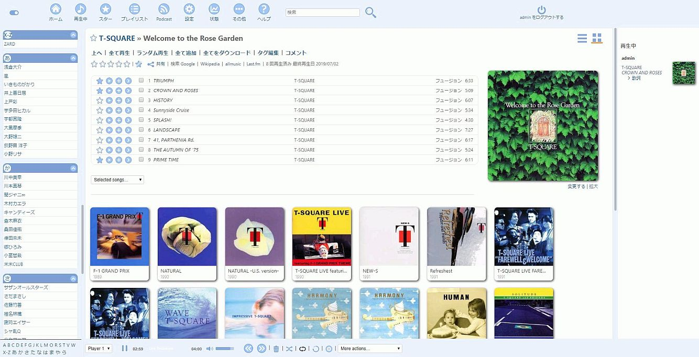
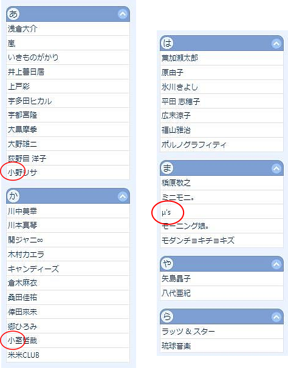
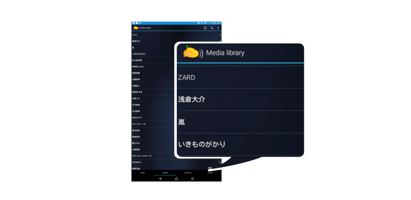
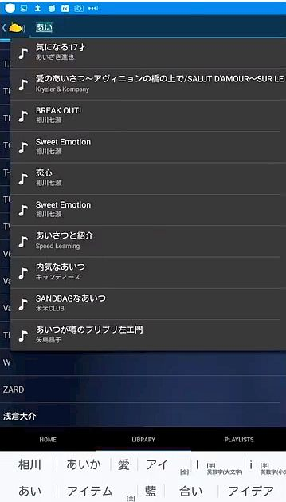
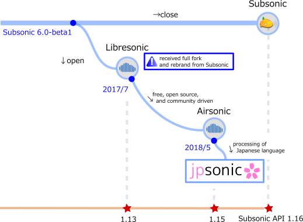

<!--
# README.md
# jpsonic/jpsonic
-->

Jpsonic
========

What is Jpsonic?
-----------------

Jpsonic is a free, web-based media streamer, providing ubiquitous access to your music.

Use it to share your music with friends, or to listen to your own music while at work.

Based on Java technology, Jpsonic runs on most platforms, including Windows, Mac, Linux and Unix variants.

Jpsonic is an [Airsonic](https://github.com/airsonic/airsonic) Clone.

Features
-----------------

Jpsonic has changed the context and data area so that it does not interfere with Subsonic or Arisonic and even simultaneous operation is possible.
The default language is set to JP so as to be intimate with Japanese people, but you can use other languages depending on your choice.

### index

Many character types such as alphabet / hiragana / katakana / kanji / symbols are used in Japanese.
Jpsonic correctly classifies them and creates a Japanese index.
It is a very general and easy-to-understand index for Japanese people, just like Japanese dictionaries, bank branch names, telephone directories and karaoke indexes.

### sort

Sort by name is expanded to allow for Japanese character string sorting.
Even with a variety of character types, Japanese people can use it without feeling uncomfortable.

These are solved by two ways of the server's Japanese analysis function and tag reading.
Therefore, not only can you handle files using CDDB perfectly.
It is also possible to mix it with "old format files" or "raw Japanese name files / directories that are not tag edited".

### search

In addition to regular Japanese phrase search, artists can also use phonetic search and forward match.

Generally, Japanese people unconsciously input 'Reading' and then convert them into appropriate character types by IME conversion.
Jpsonic enables searching during Japanese translation.

History
-----

The original *[Subsonic](http://www.subsonic.org/)* is developed by [Sindre Mehus](mailto:sindre@activeobjects.no). *Subsonic* was open source through version 6.0-beta1, and closed-source from then onwards.

*Libresonic* was created and maintained by [Eugene E. Kashpureff Jr](mailto:eugene@kashpureff.org). It originated as an unofficial("Kang") of Subsonic which did not contain the Licensing code checks present in the official builds. With the announcement of Subsonic's closed-source future, a decision was made to make a full fork and rebrand to Libresonic.

Around July 2017, it was discovered that Eugene had different intentions/goals for the project than some contributors had. 
*Airsonic* was created in order to provide a full-featured, stable, self-hosted media server based on the Subsonic codebase that is free, open source, and community driven.

Around July 2018, *Jpsonic* was created in order to strengthen browsing and searching in Japanese which is a weak point since *Subsonic*.

In Japan, Subsonic is famous but Airsonic is not well known yet.
Many Japanese will notice more about Airsonic, which has excellent engineers and a wonderful community.

Cherry Blossoms
-----

The Japanese loved cherry blossoms for hundreds of years.

Please ask the Japanese people "What is a flower?".

The Japanese will answer "Sakura".

During international exchange, Japan frequently plants cherry blossoms to show respect for partners.

License
-------

Jpsonic is free software and licensed under the [GNU General Public License version 3](http://www.gnu.org/copyleft/gpl.html). The code in this repository (and associated binaries) are free of any "license key" or other restrictions.

The [Subsonic source code](https://github.com/airsonic/subsonic-svn) was released under the GPLv3 through version 6.0-beta1. Beginning with 6.0-beta2, source is no longer provided. Binaries of Subsonic are only available under a commercial license. There is a [Subsonic Premium](http://www.subsonic.org/pages/premium.jsp) service which adds functionality not available in Airsonic. Subsonic also offers RPM, Deb, Exe, and other pre-built packages that Airsonic [currently does not](https://github.com/airsonic/airsonic/issues/65).

The cover zooming feature is provided by [jquery.fancyzoom](https://github.com/keegnotrub/jquery.fancyzoom),
released under [MIT License](http://www.opensource.org/licenses/mit-license.php).

The icons are from the amazing [feather](https://feathericons.com/) project,
and are licensed under [MIT license](https://github.com/feathericons/feather/blob/master/LICENSE).

Usage
-----

Jpsonic can be downloaded from
[GitHub](https://github.com/jpsonic/jpsonic/releases).

Specifications other than Japanese correspond to Airsonic.
Please use the [Airsonic documentation](https://airsonic.github.io/docs/) for instructions on running Airsonic.

There may be additional explanations that are not important at the [author's site](https://tesshu.com/jpsonic/) in the future.
However, most are written in Japanese.

Community
---------

The roots Airsonic have several places outside of github for community discussion, questions, etc:

- [#airsonic:matrix.org on Matrix](https://matrix.to/#/#airsonic:matrix.org)
- [#airsonic on IRC](http://webchat.freenode.net?channels=%23airsonic)
- [airsonic subreddit](https://www.reddit.com/r/airsonic)

*Note that the Matrix room and IRC channel are bridged together.*
