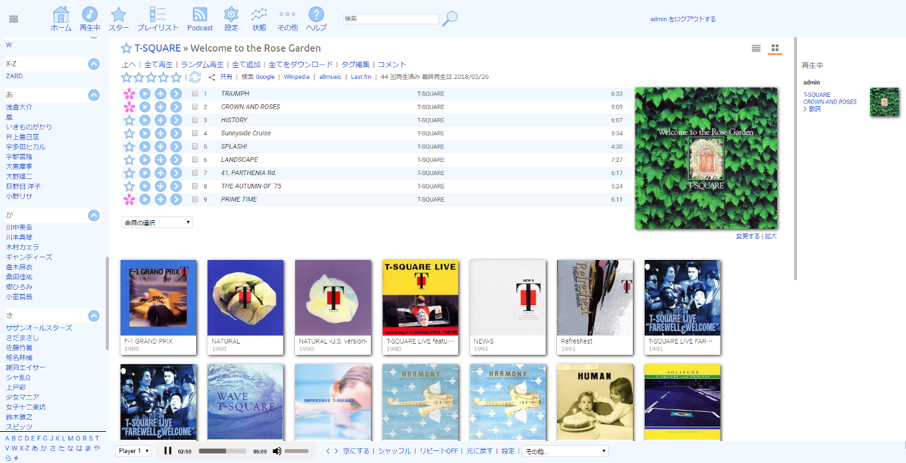

<!--
# README.md
# tesshucom/jpsonic
-->

Jpsonic
========

What is Jpsonic?
-----------------

Jpsonic is a free, web-based media streamer, providing ubiquitous access to your music.

Use it to share your music with friends, or to listen to your own music while at work.

Based on Java technology, Jpsonic runs on most platforms, including Windows, Mac, Linux and Unix variants.

Jpsonic is an [Airsonic](https://github.com/airsonic/airsonic) Clone.

Airsonic is developed and maintained by Sindre Mehus [sindre@activeobjects.no](mailto:sindre@activeobjects.no)

Features
-----------------

The feature is to be able to index Japanese name artists.

For Japanese index creation, in addition to normal processing, processing dedicated to Japanese is required.
If only normal processing is done, all Japanese name artists are classified as "#".
As a result, the Japanese could not fully utilize Subsonic or Airsonic's excellent indexing features.

Jpsonic uses [kuromoji](https://github.com/atilika/kuromoji) and performs morphological analysis when scanning media.
The user does not need to do any special work.
Just by setting and using the same as Subsonic and Airsonic, you can use Japanese index.

A detailed explanation in Japanese is [here](https://tesshu.com/jpsonic/what-is-jpsonic).

History
-----

The original [Subsonic](http://www.subsonic.org/) is developed by [Sindre Mehus](mailto:sindre@activeobjects.no). Subsonic was open source through version 6.0-beta1, and closed-source from then onwards.

Libresonic was created and maintained by [Eugene E. Kashpureff Jr](mailto:eugene@kashpureff.org). It originated as an unofficial("Kang") of Subsonic which did not contain the Licensing code checks present in the official builds. With the announcement of Subsonic's closed-source future, a decision was made to make a full fork and rebrand to Libresonic.

Around July 2017, it was discovered that Eugene had different intentions/goals
for the project than some contributors had.  Although the developers were
hesitant to create a fork as it would fracture/confuse the community even
further, it was deemed necessary in order to preserve a community-focused fork.
To reiterate this more clearly:

Airsonic's goal is to provide a full-featured, stable, self-hosted media server
based on the Subsonic codebase that is free, open source, and community driven.

In Japan, Subsonic is famous but Airsonic is not well known yet.
Jpsonic was created to strengthen Japanese-compatible functions.
Many Japanese will notice more about Airsonic, which has excellent engineers and a wonderful community.

Cherry Blossoms
-----

The Japanese loved cherry blossoms for hundreds of years.

Please ask the Japanese people "What is a flower?".

The Japanese will answer "Sakura".

During international exchange, Japan frequently plants cherry blossoms to show respect for partners.

License
-------

Jpsonic is free software and licensed under the [GNU General Public License version 3](http://www.gnu.org/copyleft/gpl.html). The code in this repository (and associated binaries) are free of any "license key" or other restrictions.

The [Subsonic source code](https://github.com/airsonic/subsonic-svn) was released under the GPLv3 through version 6.0-beta1. Beginning with 6.0-beta2, source is no longer provided. Binaries of Subsonic are only available under a commercial license. There is a [Subsonic Premium](http://www.subsonic.org/pages/premium.jsp) service which adds functionality not available in Airsonic. Subsonic also offers RPM, Deb, Exe, and other pre-built packages that Airsonic [currently does not](https://github.com/airsonic/airsonic/issues/65).

Usage
-----

Jpsonic can be downloaded from
[GitHub](https://github.com/tesshucom/jpsonic/releases).

Specifications other than Japanese correspond to Airsonic.

Please use the [Airsonic documentation](https://airsonic.github.io/docs/) for instructions on running Airsonic.

There may be additional explanations that are not important at the [author's site](https://tesshu.com/jpsonic/) in the future.
However, most are written in Japanese.

Community
---------

The roots Airsonic have several places outside of github for community discussion, questions, etc:

- [#airsonic:matrix.org on Matrix](https://matrix.to/#/#airsonic:matrix.org)
- [#airsonic on IRC](http://webchat.freenode.net?channels=%23airsonic)
- [airsonic subreddit](https://www.reddit.com/r/airsonic)

*Note that the Matrix room and IRC channel are bridged together.*
