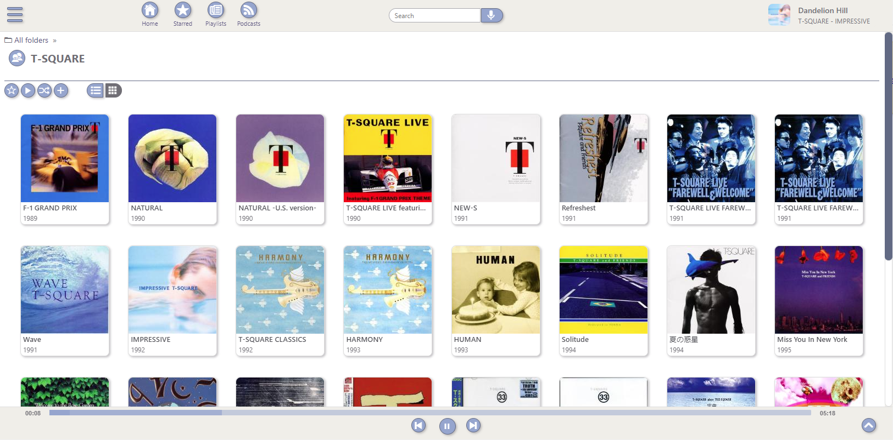
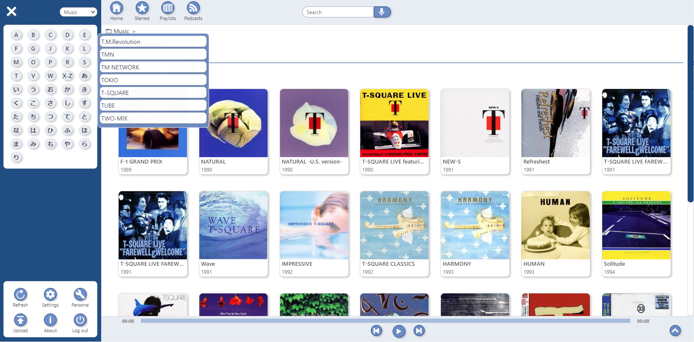
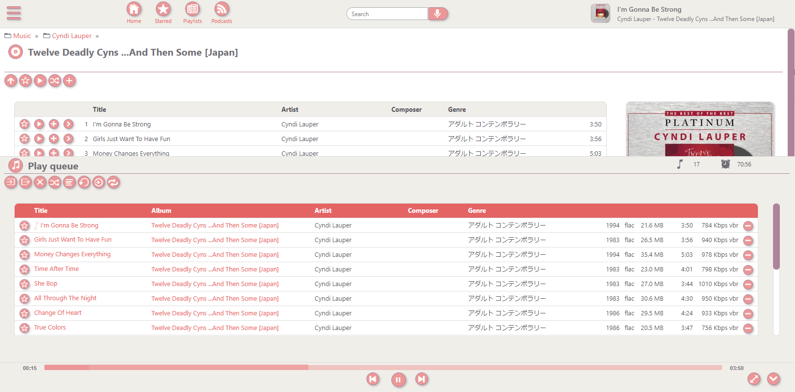
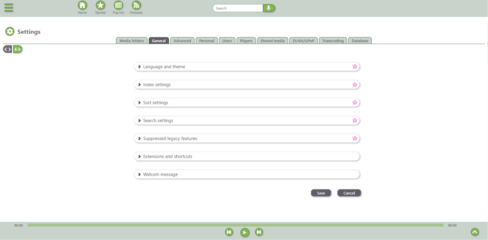

<!--
# README.md
# jpsonic/jpsonic
-->

 

Jpsonic
========

What is Jpsonic?
-----------------

Jpsonic is a free, web-based media streamer, an [Airsonic](https://github.com/airsonic/airsonic) Clone. Most media servers have difficulty managing Japanese songs. To solve this, Development of Jpsonic has started.

<table>
<tr>
<td>

</td>
<td>

</td>
<td>

</td>
<td>

</td>
</tr>
</table>

Since v110.2.0, conversion for Romanized Japanese has been supported to make it easier for non-native Japanese people to handle Japanese. And it is also possible to bypass Japanese processing and use it like a general Subdonic server.

Features
-----------------

#### Evolved meta processing

It supports standard tags, and the SONY/APPLE specifications that take into account global multilingual support are used as a reference.
To process Japanese well on a machine requires quite complicated mechanism. The index, sort, and search features of Jpsonic have been replaced with more accurate and reliable processing than Subsonic and Airsonic. Some distinctive features have been added.

 - Advanced sort tag support. In particular, artist names are automatically merged and copied, ensuring that the name and the reading correspondence is the only pair in the server. If the sort tag corresponding to Japanese is not registered, the analysis engine performs complementary processing. This guarantees the accuracy of sorting and can handle some dirty data. Regardless of Japanese, it is very advantageous for managing songs using sort tags.
 - In the case of Chinese character competitors such as Chinese, coexistence is expected by using pinyin, etc.
 - Jpsonic search covers the artist name sort-tag in addition to the regular fields. You can use apps that support server side search and use speech recognition, such as [Subsonic Music Streamer](https://play.google.com/store/apps/details?id=net.sourceforge.subsonic.androidapp&hl=ja&gl=US) and [BubbleUPnP](https://play.google.com/store/apps/details?id=com.bubblesoft.android.bubbleupnp&hl=en) .

#### Reimplemented DLNA features

DLNA (UPnP) and OpenHome is mainstream technology in Japanese typical household. For this reason, many new features have been added to Jpsonic. And stream and transcoding bug fixes have been made to make it easier to control performance in the high resolution band.

#### The client apps had used for the operation check

Indicates whether the feature is available when using a typical traditional application. Applications other than those listed here can be used, but the realization of comfortable usability also depends on the client implementation.

[Apps]
No | App Name | Platform | Protocol
-- | -- | -- | -- 
A | [Subsonic Music Streamer](https://play.google.com/store/apps/details?id=net.sourceforge.subsonic.androidapp) | Android | Subsonic API
B | [BubbleUPnP for DLNA / Chromecast / Smart TV](https://play.google.com/store/apps/details?id=com.bubblesoft.android.bubbleupnp) | Android | UPnP
C | [MediaMonkey](https://play.google.com/store/apps/details?id=com.ventismedia.android.mediamonkey) | Android | UPnP
D | [foobar2000](https://play.google.com/store/apps/details?id=com.foobar2000.foobar2000) | Android | UPnP
E | [Hi-Fi Cast - Music Player](https://play.google.com/store/apps/details?id=com.findhdmusic.app.upnpcast) | Android | UPnP
F | [AK Connect 2.0](https://play.google.com/store/apps/details?id=com.iriver.akconnect) | Android | UPnP
G | [MediaMonkey 5](https://www.mediamonkey.com/) | Windows10 | UPnP
H | [foobar2000](https://www.foobar2000.org/) | Windows10 | UPnP
I | [Windows MediaPlayer 12](https://support.microsoft.com/en-us/windows/get-windows-media-player-81718e0d-cfce-25b1-aee3-94596b658287) ([v111 higher](https://github.com/jpsonic/jpsonic/blob/master/CHANGELOG.md)) | Windows10 | UPnP

[Main cooperation features]
No | Features | Perspective
-- | -- | --
1 | FLAC playback | Whether it can be played including high-res
2 | Transcode (to MP3) | Whether stream transcoded from FLAC to MP3 can be played
3 | Transcode (to CD qual) | Whether resampled stream from high-res FLAC to CD qual can be played
4 | Sort | Whether client does not destroy the element order by the server by default
5 | Server-side search | Whether it supports server-side search
6 | Voice input | Whether it supports server-side search with voice input
7 | Lazy loading | Whether partial content acquisition is used in UPnP requests
8 | Downloader | Whether to have a practical downloader

[Correspondence situation]
  | 1 | 2 | 3 | 4 | 5 | 6 | 7 | 8
-- | -- | -- | -- | -- | -- | -- | -- | --
A | ★ | ★ |   | ★ | ★ | ★ | N | 
B | ★ | ★ | ★ | ★ | ★ | ★ | ☆1 | ★
C | ★ | ★ | ★ | ★ | N | N | ☆1 |
D | ★ | ☆2 | ★ | ★ | N | N | ☆1 | ★
E | ★ | ★ | ★ | ★ | ☆4 | N | ☆1 |
F | ☆3 | ★ | ★ | ★ | ☆4 | N | N |
G | ★ |   |   | ★ | N |   | ☆1 |
H | ★ | ★ | ★ |   | ☆4 |   | ☆1 |
I | ★ | ★ | ★ |   | N |   | ☆5 |

 - ☆1 The specified value is different for each client. 
     - BubbleUPnP/MediaMonkey(Android)/Hi-Fi Cast : Get the rest after getting the data for view area.
     - MediaMonkey(Win) : Get data for a specific quantity.
     - foobar2000 : Get for each fixed number of items, but it may be difficult to obtain benefits due to the large number of items acquired at one time.
 - ☆2 Playback may not be possible if resampling takes a very long time, such as high-resolution classical songs.
 - ☆3 High resolution may be difficult.
 - ☆4 Jpsonic doesn't support that query yet　(Sequentially considered).
 - ☆5 Special process. Crawl all resources at startup.

Usage
-----

The basic installation procedure is almost the same as Airsonic. Please use the [Airsonic documentation](https://airsonic.github.io/docs/) for instructions on running Airsonic. A more detailed specification description can be found at the [author's site](https://tesshu.com/category/spec).

History
-----

Subsonic, Libresonic, Airsonic

The original *[Subsonic](http://www.subsonic.org/)* is developed by [Sindre Mehus](mailto:sindre@activeobjects.no). *Subsonic* was open source through version 6.0-beta1, and closed-source from then onwards.

*Libresonic* was created and maintained by [Eugene E. Kashpureff Jr](mailto:eugene@kashpureff.org). It originated as an unofficial("Kang") of Subsonic which did not contain the Licensing code checks present in the official builds. With the announcement of Subsonic's closed-source future, a decision was made to make a full fork and rebrand to Libresonic.

Around July 2017, it was discovered that Eugene had different intentions/goals for the project than some contributors had. 
*Airsonic* was created in order to provide a full-featured, stable, self-hosted media server based on the Subsonic codebase that is free, open source, and community driven.

Jpsonic

Around July 2018, *Jpsonic* was created in order to strengthen browsing and searching in Japanese.

In Japan, Subsonic is famous, but Airsonic was not yet well known.
Today, Airsonic, with its great engineers and great community, is gaining recognition.

Jpsonic had to update its indexing, sorting, and searching due to its characteristics.
Many of these features have bug fixes or enhancements.
An update to the Jpsonic search engine has been provided to Airsonic.
Therefore, the design of the search function of Airsonic and Jpsonic is a bit similar.

Cherry Blossoms

The Japanese loved cherry blossoms for hundreds of years. Please ask the Japanese people "What is a flower?". The Japanese will answer "Sakura". The Japanese frequently plants cherry blossoms in international exchange to show respect for partners.

License
-------

Jpsonic is free software and licensed under the [GNU General Public License version 3](http://www.gnu.org/copyleft/gpl.html). The code in this repository (and associated binaries) are free of any "license key" or other restrictions.

The [Subsonic source code](https://github.com/airsonic/subsonic-svn) was released under the GPLv3 through version 6.0-beta1. Beginning with 6.0-beta2, source is no longer provided. Binaries of Subsonic are only available under a commercial license. There is a [Subsonic Premium](http://www.subsonic.org/pages/premium.jsp) service which adds functionality not available in Airsonic. Subsonic also offers RPM, Deb, Exe, and other pre-built packages that Airsonic [currently does not](https://github.com/airsonic/airsonic/issues/65).

<dl>
    <dt>Japanese morphological analyzer</dt>
    <dd><a href="https://www.atilika.org/" target="_blank">Kuromoji</a> is an open source Japanese morphological analyzer written in Java. Licensed under the Apache License v2.0 and uses the MeCab-IPADIC dictionary/statistical model. (C) 2011-2014 Atilika Inc.</dd>
    <dt>Japanese font</dt>
    <dd><a href="https://kazesawa.github.io/" target="_blank">Kazesawa</a> is Japanese TrueType font aims to achieve both visibility on the screen and appropriate information density. Provided under the SIL Open Font License. (C) 2002-2015 M+ FONTS PROJECT.</dd>
    <dt>Icon font</dt>
    <dd><a href="https://ionicons.com/" target="_blank">Ionicons</a> is a completely open-source icon set with 1,300 icons crafted for web, iOS, Android, and desktop apps, are free to use and licensed under MIT. (C) 2021 ionic-team</dd>
    <dt>Avatar Icon</dt>
    <dd>Created using Iconpon, a material site that provides image materials such as icons and related services. Icon by <a href="https://www.iconpon.com/" target="_blank">iconpon.com</a></dd>
</dl>
